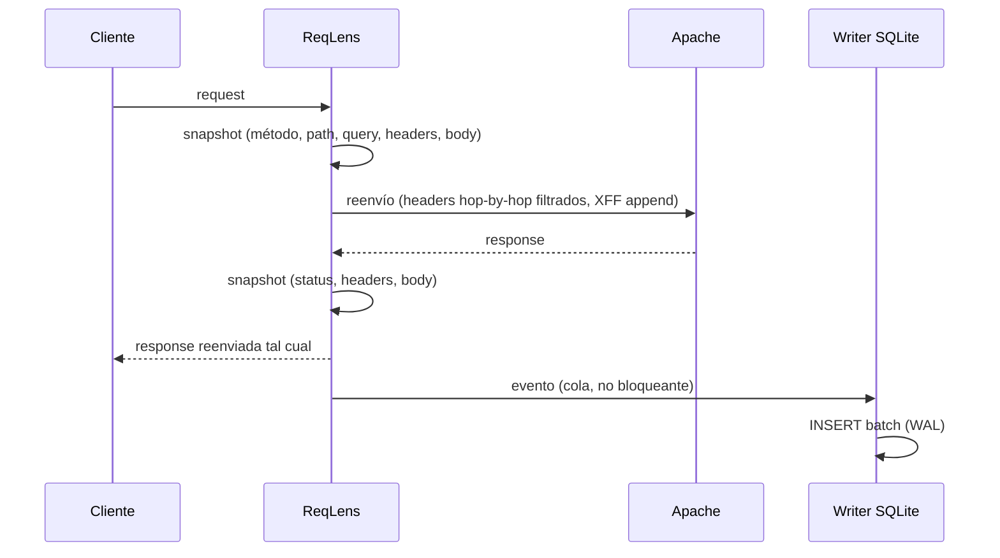

# ReqLens — Arquitectura

> Cómo está construido ReqLens y por qué se decidió así. Para usarlo → [README.md](./README.md).

---

## Resumen

ReqLens es un **proxy reverso** que se coloca entre los clientes y Apache. Por cada request captura quién lo envía, a qué endpoint, qué payload, y qué respondió Apache (status + body). Todo queda en una base SQLite consultable con SQL.

```
Cliente ──▶ ReqLens (:8080) ──▶ Apache (:80) ──▶ App Backend
                │
                └──▶ SQLite (data/reqlens.db, WAL)
```

Dos reglas no negociables que condicionan todo el diseño:

1. **Apache no se toca** — ni config, ni módulos, ni reinicios.
2. **La observabilidad nunca degrada el tráfico** — si la captura o el almacenamiento fallan, el proxy sigue sirviendo (fail-open).

No es un WAF, no balancea, no hace TLS, no analiza streaming.

---

## Decisiones de diseño

### Proxy en vez de módulo de Apache

Capturar cuerpos con `mod_dumpio` o un módulo custom exige tocar Apache (viola la regla 1) y acoplarse a su ABI. Un proxy propio controla el 100% del ciclo HTTP sin intervenir. El coste: ReqLens pasa a ser punto único del path, así que debe fallar abierto y tener runbook (ver Operación).

### hyper + tokio en vez de axum

Para reenviar tráfico crudo 1:1 (headers, chunked, upgrades) conviene `hyper` directo, que expone el request/response sin re-codificarlos. `axum` añade routing que aquí es innecesario. El coste: más código de bajo nivel.

### Captura asíncrona con cola acotada

Escribir en la base dentro del path de respuesta haría que una base lenta degrade el tráfico. Por eso la captura va a una **cola de 1024 eventos** y un writer dedicado persiste en batches. Si la cola se llena (saturación sostenida), se **descartan eventos y se cuenta** — nunca se bloquea al cliente. Garantía global: at-most-once.

### SQLite como almacén

Se necesita consultar con SQL sin levantar infraestructura. SQLite lo da todo en un archivo. El coste: **escritor único**, así que el writer hace batches (100 eventos o 250 ms) y se acepta un throughput del orden de miles de req/s, no millones. Modo WAL permite consultar con `sqlite3` mientras ReqLens corre.

### Redacción de secretos activada por defecto

Los payloads pueden contener passwords, tokens o PII. La redacción está **on por defecto** (fail-safe): desactivarla requiere `--no-redact` explícito, que avisa en el arranque. Límite conocido: cubre una lista configurable de claves + regex de respaldo; un campo sensible fuera de la lista se capturará.

---

## Flujo de datos



Puntos clave del path:

- El body del request se lee **una sola vez** a buffer; ese buffer sirve para captura y para reenvío.
- El body de la respuesta se limita a `--max-body`; el resto se reenvía en streaming (memoria acotada por request).
- `X-Forwarded-For` se hace **append** del IP real de la socket, nunca replace — Apache decide si confiar.
- El evento viaja por la cola en paralelo; el cliente recibe la respuesta sin esperar al disco.

## Concurrencia

- **Un task por rol**: acceptor, handlers por conexión, writer SQLite único, señal de shutdown.
- **Cola de 1024 eventos**: ~1 s de ráfaga a 1 k req/s; peor caso de memoria ~128 MB.
- **Batch de 100 eventos o 250 ms**, lo que ocurra primero. Un commit por evento sería demasiado caro (b-tree + fsync).
- **Shutdown ordenado**: SIGTERM → dejar de aceptar → drenar requests en vuelo → drenar cola → commit final → exit 0. Si el drenado excede el timeout, exit 1 con error explícito.

## Garantías

| Situación               | Qué pasa                                                            |
| ----------------------- | ------------------------------------------------------------------- |
| Crash del proceso       | Se pierde ≤ 100 eventos o 250 ms (el último batch sin commit)       |
| Cola llena (saturación) | Se descartan eventos; se registran y cuentan; el tráfico sigue      |
| Disco lleno             | El batch se revierte completo; error con contexto; el tráfico sigue |
| Shutdown limpio         | No se pierde nada                                                   |

**En resumen: at-most-once.** Aceptable para telemetría; no para auditoría legal.

## Edge cases del proxy

- **Headers hop-by-hop** (`Connection`, `Keep-Alive`, `Transfer-Encoding`, `Upgrade`, `Proxy-*`): se eliminan al reenviar; hyper los re-emite correctamente.
- **Chunked**: se reenvía tal cual; la captura guarda el body lógico des-chunked.
- **`gzip`/`br`/`deflate`**: el body se marca `[COMPRESSED]`, no se descomprime (costo de CPU injustificado por defecto).
- **WebSocket**: solo se captura el handshake; los frames posteriores no (diferido).
- **Upstream colgado**: timeouts configurables; si Apache no responde, `502 Bad Gateway` en vez de colgar al cliente.
- **CRLF injection**: imposible por la validación de hyper en names/values.

---

## Base de datos

Tabla única `requests`, desnormalizada a propósito (nunca se consulta por un header individual, así que no merece tablas hijas):

| Columna        | Tipo        | Contenido                                            |
| -------------- | ----------- | ---------------------------------------------------- |
| `id`           | INTEGER PK  | Autoincremental                                      |
| `timestamp`    | TEXT        | UTC ISO-8601 con milisegundos (ordenable, indexable) |
| `duration_ms`  | INTEGER     | Latencia del ciclo proxy                             |
| `client_ip`    | TEXT        | Último hop de `X-Forwarded-For`, o socket            |
| `client_ua`    | TEXT        | User-Agent                                           |
| `method`       | TEXT        | Método HTTP                                          |
| `path`         | TEXT        | Endpoint (crudo)                                     |
| `query`        | TEXT        | Query string (crudo, sin decodificar)                |
| `req_headers`  | TEXT (JSON) | Headers de la allowlist                              |
| `req_body`     | TEXT        | Body del request                                     |
| `resp_status`  | INTEGER     | Status devuelto por Apache                           |
| `resp_headers` | TEXT (JSON) | Headers de la allowlist                              |
| `resp_body`    | TEXT        | Body de la respuesta                                 |

Índices: `(timestamp)`, `(method, path)`, `(resp_status)`, `(client_ip)`. Cada uno amplifica el INSERT (~4× en total); no se añade ninguno más sin una consulta real que lo justifique.

DDL idempotente en cada arranque (`CREATE TABLE IF NOT EXISTS` + índices). Migraciones futuras: tabla nueva + backfill, nunca `ALTER` destructivo.

### Consultas útiles

```sql
-- Últimos 50 requests
SELECT timestamp, method, path, resp_status, duration_ms
FROM requests ORDER BY timestamp DESC LIMIT 50;

-- Requests a /api/login en las últimas 24h
SELECT * FROM requests
WHERE path = '/api/login' AND timestamp >= datetime('now', '-1 day');

-- Top endpoints con status 5xx
SELECT path, COUNT(*) AS errores FROM requests
WHERE resp_status >= 500 GROUP BY path ORDER BY errores DESC;

-- Actividad por cliente
SELECT client_ip, COUNT(*) AS requests FROM requests
GROUP BY client_ip ORDER BY requests DESC;
```

### Reglas de contenido

- Solo headers de una allowlist; `authorization`, `cookie`, `set-cookie` **nunca** se capturan.
- Binario → `[BINARY]`; comprimido → `[COMPRESSED]`; sensible → `[REDACTED]`; excede `--max-body` → prefijo + `[TRUNCATED]`.

### Crecimiento

≈ 500 B + bodies por fila. A 1 k req/s con bodies de 1 KB promedio → **~1.5 GB/día**. Este número decide cuándo activar particionado/retención (roadmap).

---

## Seguridad

| Amenaza                       | Mitigación                                                                             |
| ----------------------------- | -------------------------------------------------------------------------------------- |
| Filtración de secretos        | Redacción default-on + allowlist de headers + archivo `0600`                           |
| Spoofing de `X-Forwarded-For` | Se hace append del IP real de socket, nunca replace                                    |
| DoS por body gigante          | Captura acotada por `--max-body`; el reenvío es streaming                              |
| Request smuggling (CL/TE)     | hyper normaliza; el body capturado es el lógico. Riesgo residual → testing adversarial |
| Acceso al `.db`               | Permisos `0600`; SQLite no cifra (SQLCipher diferido)                                  |
| Inyección SQL                 | No aplica: todos los valores van como parámetros vinculados, nunca concatenados        |
| SSRF                          | ReqLens es un proxy; el upstream es configuración, no input del cliente                |

- Redacción: si el body es JSON, se reemplazan valores de claves sensibles (`password`, `token`, `secret`, `api_key`...) por `[REDACTED]`. Si no es JSON, regex sobre pares `clave=valor`.
- Servicio sin root con hardening systemd (`NoNewPrivileges`, `ProtectSystem=strict`) — ver Operación.

---

## Operación

```bash
# Backup en caliente (seguro con WAL; nunca copies el .db a pelo sin -wal/-shm)
sqlite3 data/reqlens.db ".backup 'reqlens.backup.db'"

# Integridad
sqlite3 data/reqlens.db "PRAGMA integrity_check;"

# Si el -wal crece sin límite (sesión sqlite3 abierta sin commit)
sqlite3 data/reqlens.db "PRAGMA wal_checkpoint(TRUNCATE);"
```

Troubleshooting rápido:

| Síntoma                    | Causa                             | Solución                                      |
| -------------------------- | --------------------------------- | --------------------------------------------- |
| Puerto ocupado al arrancar | Listener en uso                   | Cambia `--listen`                             |
| `database is locked`       | Transacción `sqlite3` abierta     | Ciérrala; el writer no bloquea lecturas (WAL) |
| No aparecen eventos        | Persistencia asíncrona (≤ 250 ms) | Reintenta; revisa logs de ingest              |
| `[BINARY]` en bodies       | Content-Type no textual           | Esperado por diseño                           |

Despliegue: binario estático + unit file systemd (usuario dedicado, sin root, `ReadWritePaths` solo al directorio de datos). Ejemplo completo en `README.md` o se puede generar con `cargo install --path . --locked`.

## Rendimiento esperado

- Objetivo: ≥ 5 k req/s en hardware commodity (NVMe, WAL).
- Coste por request: 1 read de body (limitado) + 1 read de respuesta (limitado) + 1 INSERT con 4 índices.
- Memoria en vuelo: ≤ 2 × `--max-body` por request (~12.8 MB con ~100 concurrentes y default).

---

## Estructura del código

```
src/
├── main.rs                      # Bootstrap: config → runtime → server + shutdown
├── config/                      # CLI + env, defaults seguros
├── proxy/                       # Listener, reenvío, cliente upstream
├── capture/                     # Snapshots de request/response, redacción, límites
├── ingest/                      # Evento, schema SQLite, writer con batch
└── error.rs                     # Errores tipados, nunca silenciados
```

Reglas de dependencia:

```
config ◀───── main
   ▲
proxy ──▶ capture ──▶ ingest
   │         │
   └─────────┴──▶ error (compartido)
```

- `proxy` observa el tráfico vía `capture`, nunca al revés.
- `capture` produce eventos; `ingest` los persiste. No se conocen entre sí.
- Ningún dominio conoce el framework HTTP salvo `proxy`.

## Testing

| Nivel       | Cobertura                                                                 |
| ----------- | ------------------------------------------------------------------------- |
| Unit        | Redacción (incl. intentos de bypass), límites, allowlist, DDL idempotente |
| Integración | Snapshots, writer (commit y rollback) con SQLite `:memory:`               |
| E2E         | Proxy completo → upstream mock → validación de filas insertadas           |
| Adversarial | Cola llena, disco lleno, crash a mitad de batch, smuggling CL/TE          |
| Propiedades | Un password real jamás aparece tras la redacción                          |

---

## Pendiente (no implementar aún)

Particionado por fecha + retención · `/metrics` y `/healthz` · exportación a NDJSON/CSV · filtros de captura por path · descompresión de bodies · captura de WebSocket frames · modo offline (analizar `access.log`).
