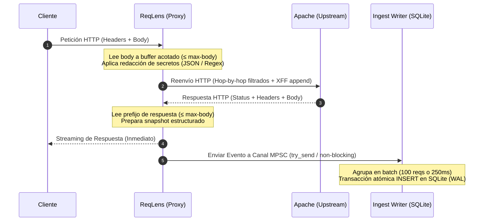

# ReqLens — Arquitectura del Sistema

> Especificación técnica, decisiones arquitectónicas (ADRs), modelo de concurrencia, flujo de datos y estrategia de verificación.
> Para la visión general del producto → [README.md](README.md). Para el modelo físico de datos → [docs/DATA.md](docs/DATA.md).

| Propiedad | Especificación |
| :--- | :--- |
| **Versión de Arquitectura** | 0.1.5 (Universal POSIX / Multi-Init / Self-Deploy) |
| **Lenguaje y Runtime** | Rust 2024 edition / Native POSIX Threadpool |


| **Capa de Red** | Hyper (HTTP/1.1 Client & Server) |
| **Persistencia** | SQLite 3 (WAL mode) via pool monohilo dedicado |
| **Audiencia** | Arquitectos de Software, Desarrolladores Core y Contribuidores |

---

## 1. Topología del Sistema e Invariantes

ReqLens se ubica como un nodo intermedio transparente entre los clientes externos y el servidor web Apache. Su misión es capturar la trazabilidad completa del ciclo de vida HTTP sin acoplarse al ciclo de ejecución de Apache.

```
┌──────────────┐         ┌──────────────────────────────────────────────────────────┐         ┌──────────────┐
│   Cliente    │◀───────▶│                     ReqLens (:8080)                      │◀───────▶│ Apache (:80) │
└──────────────┘   HTTP  │                                                          │   HTTP  └──────┬───────┘
                         │  ┌────────────────┐     Non-blocking    ┌─────────────┐  │                │
                         │  │  Proxy Handler │──── MPSC Channel ──▶│ Ingest Task │  │                ▼
                         │  └────────────────┘     (1024 slots)    └──────┬──────┘  │         ┌──────────────┐
                         └────────────────────────────────────────────────┼─────────┘         │ App Backend  │
                                                                          │                   └──────────────┘
                                                                          ▼ WAL Mode
                                                                   ┌──────────────┐
                                                                   │ SQLite (.db) │
                                                                   └──────────────┘
```

### Invariantes No Negociables del Diseño

1. **Inviolabilidad de Apache (Zero-Touch Upstream):** Apache se trata como una caja negra inmutable. No se instalan módulos en C (`mod_dumpio`), no se modifican `VirtualHosts` ni se ejecutan reinicios del servicio.
2. **Aislamiento de Fallo (Fail-Open Absoluto):** La observabilidad es secundaria frente a la disponibilidad del servicio. Si la persistencia se satura, el disco se llena o la base de datos se corrompe, el tráfico HTTP sigue fluyendo sin interrupciones.
3. **Latencia Cero en el Camino Crítico:** La escritura en disco ocurre fuera del hilo de respuesta. El cliente recibe el payload devuelto por Apache tan pronto como los bytes están disponibles en el socket.

---

## 2. Registro de Decisiones de Arquitectura (ADRs)

### ADR-001: Proxy Reverso Autónomo vs. Módulo Nativo de Apache
* **Contexto:** La captura de cuerpos en Apache tradicionalmente se realiza con `mod_dumpio` o extensiones personalizadas en C.
* **Decisión:** Desarrollar un binario independiente en Rust que actúe como proxy reverso HTTP.
* **Justificación:** Los módulos de Apache comparten espacio de memoria con los procesos de trabajo del servidor web; un fallo en el módulo puede derribar el servidor completo. Un proxy autónomo desacopla totalmente el ciclo de vida y previene fugas de memoria en Apache.
* **Trade-off y Mitigación:** Introduce un salto de red adicional (~0.2ms en localhost). Mitigado mediante I/O asíncrona de alto rendimiento con `tokio` y buffers reutilizables.

### ADR-002: Reenvío Directo con `hyper` vs. Frameworks de Enrutamiento (`axum`, `actix-web`)
* **Contexto:** Se requiere recibir peticiones HTTP arbitrarias y reenviarlas íntegramente al upstream.
* **Decisión:** Construir el proxy directamente sobre la API de bajo nivel de `hyper`.
* **Justificación:** Los frameworks web convencionales imponen capas de routing, middleware y tipado estricto de rutas que añaden sobrecarga innecesaria. `hyper` permite manipular directamente streams de bytes, gestionar cabeceras hop-by-hop y reenviar payloads crudos con fidelidad 1:1.
* **Trade-off:** Mayor complejidad en la gestión manual de conexiones y timeouts.

### ADR-003: Persistencia Asíncrona con Canal Acotado (Bounded MPSC)
* **Contexto:** SQLite utiliza un modelo de escritor único (*single-writer*). Escribir secuencialmente en el hilo de la petición HTTP destruiría el throughput.
* **Decisión:** Desacoplar la captura mediante un canal `tokio::sync::mpsc::channel` con capacidad fija de 1024 eventos y un actor monohilo consumidor.
* **Justificación:** Garantiza un consumo de memoria acotado (~128 MB en el peor escenario) e independiza la latencia de red de la velocidad de sincronización de disco (`fsync`).
* **Garantía:** Si la cola se llena debido a saturación sostenida, los eventos excedentes se descartan ordenadamente (*at-most-once*).

### ADR-004: Motor Embebido SQLite en Modo WAL
* **Contexto:** Se necesita consultar los datos con SQL estándar sin obligar al operador a provisionar infraestructura externa (PostgreSQL, ClickHouse o ELK).
* **Decisión:** Utilizar SQLite local configurado en modo Write-Ahead Logging (`PRAGMA journal_mode=WAL`).
* **Justificación:** SQLite almacena todo en un único archivo portable. El modo WAL permite que múltiples sesiones de lectura (ej. CLI `sqlite3` o dashboards) consulten concurrentemente sin bloquear al escritor en segundo plano.
* **Trade-off:** Throughput limitado a ~5,000 req/s por nodo. Suficiente para la escala objetivo de monitorización por servidor.

---

## 3. Flujo de Datos y Ciclo de Vida de la Petición

El siguiente diagrama detalla la interacción y el momento exacto en que se realiza la captura sin bloquear la entrega al cliente:



### Puntos Críticos del Pipeline de Captura

1. **Lectura Unificada de Body:** El cuerpo del request se lee exactamente una vez en memoria hasta el límite `--max-body`. El mismo buffer sirve para la inspección/redacción y para generar el stream de salida hacia Apache.
2. **Reenvío en Streaming:** Las respuestas del backend mayores al límite de captura transmiten el resto del payload en streaming continuo directo al socket cliente, evitando acumulación de memoria.
3. **Manejo de IP Real:** La cabecera `X-Forwarded-For` nunca se sobrescribe; se añade la IP del socket entrante al final de la cadena existente, permitiendo a Apache y al backend validar la confianza de los proxies anteriores.

---

## 4. Modelo de Concurrencia y Resiliencia

### Topología de Tareas Asíncronas

```
┌─────────────────────────────────────────────────────────────┐
│                       Tokio Runtime                         │
│                                                             │
│  ┌──────────────────┐       ┌────────────────────────────┐  │
│  │  Acceptor Loop   │──────▶│ Connection Tasks (N Tokio) │  │
│  └──────────────────┘       └─────────────┬──────────────┘  │
│                                           │ try_send()      │
│  ┌──────────────────┐                     ▼                 │
│  │ Shutdown Handler │◀ ─ ─ ─ ─ ─ ─  ┌───────────┐           │
│  └──────────────────┘               │ MPSC 1024 │           │
│                                     └─────┬─────┘           │
│                                           │ recv_many()     │
│                                           ▼                 │
│                             ┌────────────────────────────┐  │
│                             │ Ingest Task (Single-Writer)│  │
│                             └─────────────┬──────────────┘  │
└───────────────────────────────────────────┼─────────────────┘
                                            ▼
                                     ┌──────────────┐
                                     │ SQLite (WAL) │
                                     └──────────────┘
```

### Matriz de Resiliencia (*At-Most-Once Delivery*)

ReqLens prioriza la continuidad del negocio frente a la integridad analítica exhaustiva:

| Contingencia | Impacto en Tráfico HTTP | Impacto en Telemetría / Persistencia |
| :--- | :--- | :--- |
| **Crash inesperado del proceso** | Se restablece con reinicio automático de systemd. | Pérdida acotada al lote en memoria sin commitear ($\le$ 100 eventos o $\le$ 250 ms). |
| **Saturación sostenida (>1k req/s)** | Ninguno. El tráfico fluye a máxima velocidad de red. | Descarte controlado de eventos por cola llena; se incrementa el contador de drops en logs. |
| **Agotamiento de espacio en disco** | Ninguno. El proxy sigue atendiendo peticiones. | Rollback del lote fallido; logs de advertencia continuos hasta liberar espacio. |
| **Parada limpia (SIGTERM/SIGINT)** | Cierre ordenado de conexiones activas. | Drenado completo de la cola MPSC y commit final a SQLite antes del exit 0. |

---

## 5. Tratamiento de Casos Límite del Protocolo HTTP

- **Cabeceras Hop-by-Hop:** Se eliminan sistemáticamente de la petición y la respuesta (`Connection`, `Keep-Alive`, `Proxy-Authenticate`, `Proxy-Authorization`, `TE`, `Trailers`, `Transfer-Encoding`, `Upgrade`) para que `hyper` gestione la sesión TCP de forma autónoma con el upstream.
- **Transferencias Chunked:** Se reenvían en formato chunked; la capa de captura desfragmenta el payload para registrar el body lógico estructurado en la base de datos.
- **Cargas Comprimidas:** Peticiones o respuestas con `Content-Encoding: gzip/br/deflate` se registran con el marcador `[COMPRESSED]`. Descomprimir en vuelo añadiría un consumo inaceptable de CPU y riesgo de ataques de descompresión (*zip bombs*).
- **Timeouts de Upstream:** Si Apache no responde dentro del límite configurado, ReqLens cierra la conexión hacia el backend y emite un `502 Bad Gateway` con estructura limpia hacia el cliente.

---

## 6. Arquitectura de Módulos (Screaming Architecture)

El árbol de código refleja directamente los dominios funcionales del sistema:

```
src/
├── main.rs          # Bootstrap del runtime, inyección de dependencias y graceful shutdown
├── config/          # Parseo de CLI / variables de entorno con validación fail-fast
├── proxy/           # Motor de red HTTP (Hyper), gestión de upstream y conexión TCP
├── capture/         # Normalización de eventos, allowlist de headers y redacción de secretos
├── ingest/          # Schema SQLite, canal MPSC y persistencia por lotes transaccionales
├── tui/             # Interfaz de terminal interactiva (Ratatui / Crossterm) y vistas
└── error.rs         # Catálogo de errores tipados de dominio (thiserror)
```

### Reglas de Dependencia Unidireccional
- `proxy` únicamente depende de `capture` para generar los snapshots.
- `capture` produce eventos agnósticos que envía a `ingest`.
- `ingest` desconoce por completo la existencia de HTTP, sockets o `hyper`.
- `tui` consume datos de forma reactiva y de solo lectura de SQLite sin interferir en el camino de red.
- Los errores son tipados y nunca se silencian en ninguna capa.


---

## 7. Estrategia de Verificación y Testing

| Nivel de Test | Alcance y Aislamiento | Ejecución |
| :--- | :--- | :--- |
| **Unit Tests** | Algoritmos de redacción JSON, expresiones regulares de respaldo, allowlist de cabeceras y límites de truncado de buffer. | En memoria, ejecución paralela ultra-rápida. |
| **Integration Tests** | Writer transaccional de SQLite, verificación de commits por tamaño (100) y tiempo (250ms), rollback ante errores usando `:memory:`. | Pruebas asíncronas con base SQLite en memoria. |
| **End-to-End (E2E)** | Proxy completo escuchando en socket real contra un servidor upstream mock, verificando la correspondencia exacta de filas en SQLite. | Instancias locales aisladas en puertos dinámicos. |
| **Adversarial / Chaos** | Simulación de saturación de cola MPSC, desconexión de upstream y validación de política *fail-open*. | Inyección de fallos controlada en tests de estrés. |

---

## 📚 Enlaces de Referencia
- [docs/DATA.md](docs/DATA.md) — Definición DDL, diccionario de columnas y recetario SQL.
- [docs/OPERATIONS.md](docs/OPERATIONS.md) — Guía SRE, unidad systemd, backups y troubleshooting.
- [docs/SECURITY.md](docs/SECURITY.md) — Modelo de amenazas, redacción de secretos y hardening.


